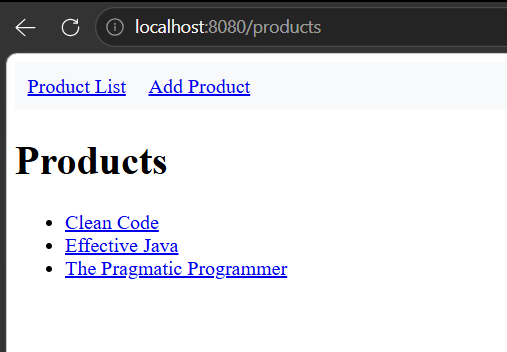
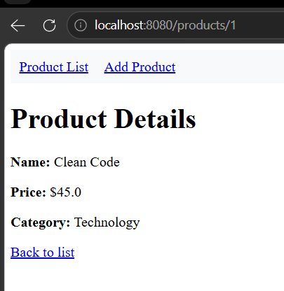

# Lab 4: Server-Rendered CRUD Interface

**Course:** WEBDEV2  
**Term:** Prelim — Week 4  

---

## Task Evidence

### Task 1 — Product List Template
- **Template:** `src/main/resources/templates/products.html`
- **Description:** Renders product list using `th:each` and handles empty states using `th:if`.

---

### Task 2 — Product Detail Template
- **Template:** `src/main/resources/templates/product-detail.html`
- **Description:** Displays product details with nested property access (`product.category.name`).

---

### Task 3 — Shared Navigation Fragment
- **Fragment:** `src/main/resources/templates/fragments/navbar.html`
- **Description:** Shared navigation fragment embedded using `th:replace`.

---

### Task 4 — Create Form
- **Template:** `src/main/resources/templates/product-form.html`
- **Description:** Bound form using `th:object` and `th:field` submitting to `POST /products`.

---

### Task 5 — Binding Errors on Create Form
- **Controller & Template:** Updated `POST /products` method with `BindingResult` and `th:errors` display.
- **Description:** Form redisplays with error messages when invalid data fails binding.

